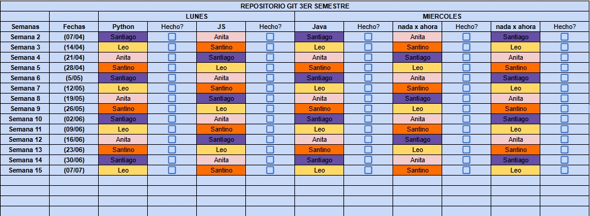

<!-- GIF de presentación -->

  

<!-- Título principal -->
<h2 align="center">Repositorio del tercer semestre del grupo "CodeX5", somos estudiantes de la Tecnicatura Universitaria en Programación UTN 2024</h2>

<!-- Logo del grupo -->

  

<!-- Tabla de organización -->
<h2 align="center">Organización del Grupo</h2>

  

<!-- Equipo de trabajo -->
<h2 align="center">Equipo de Trabajo</h2>
<table align="center">
  <tr>
    <td align="center">
      <a href="https://github.com/Anitacnieto">
         
        <b>Ana Castro</b>
      </a>
    </td>
    <td align="center">
      <a href="https://github.com/SantyCalz">
         
        <b>Santiago Calzolari</b>
      </a>
    </td>
    <td align="center">
      <a href="https://github.com/leopa18">
         
        <b>Leonel Palominos</b>
      </a>
    </td>
    <td align="center">
      <a href="https://github.com/SantiiSala">
         
        <b>Santino Salatino</b>
      </a>
    </td>
  </tr>
</table>
